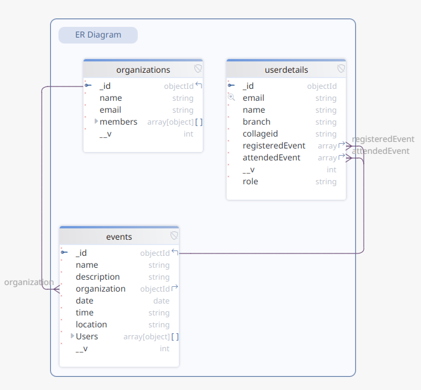

#  Eventify: University & Club Event Management Platform

---

## What is Eventify?

**Eventify** is a full-stack web application built to streamline and centralize event management across universities and student-led clubs. Whether it's workshops, seminars, or tech fests, Eventify empowers organizers and participants through a modern digital platform that eliminates the need for spreadsheets and manual coordination.

---

##  Who is it for?

* 🎓 **University administrators**
* 🧑‍🎓 **Student clubs and organizations**
* 📢 **Event coordinators**
* 🙋‍♂️ **Participants and attendees**

Anyone looking to simplify **event creation, registration, check-in, and communication**.

---

## 🛠️ Features

* 🔐 **Google OAuth** for one-click sign-in
* 📝 **Event creation** and management by authorized organizers
* 👥 **Member roles** and access-level permissions
* 📷 **QR-based check-in** system for attendance
* 📊 **Registration insights** and analytics per event
* ✉️ **Automated bulk emails** via **Mailgun** on event triggers

---

## 📊 ER Diagram

> Here's a visual representation of the database schema used in Eventify:

 

---

## 🚀 How to Run the Project

### ✅ Prerequisites

* Node.js `v18+`
* MongoDB Atlas
* Firebase Project (for Auth)
* Mailgun Account
* Vite (optional, if using for frontend)

---

### 📁 `.env` Configuration

Create a `.env` file in both **frontend** and **backend** directories.

#### 🛠️ Backend `.env`

```env

MAILGUN_API_KEY=your_mailgun_api_key
JWT_SECRET=your_secret_key
DATABASE_URL="mongodb+srv://<username>:<password>@<cluster>.mongodb.net/<dbname>?retryWrites=true&w=majority"

```

#### 🌐 Frontend `.env`

```env

 REACT_APP_API_KEY=your_firebase_api_key
 REACT_APP_DOMAIN=your_project_id.firebaseapp.com
 REACT_APP_PROJECTID=your_project_id
 REACT_APP_BUCKET=your_project_id.appspot.com
 REACT_APP_MESSAGESENDERID=your_sender_id
 REACT_APP_APPID=1:your_app_id
 REACT_APP_MEASUREMENTID=G-NK7TMQ2B1K

```

---

### ⚙️ Installation & Run

#### 🔄 Backend

```bash

cd server
npm install
npm run dev
```

#### 💻 Frontend

```bash

cd client
npm install
npm run dev
```

---

## 📹 Demo Video

🎥 [Watch the walkthrough video here](https://your-demo-link.com) <!-- Replace with your actual demo video link -->

---

## 🧱 Tech Stack

| Logo                                                                                                           | Tech                                   |
| -------------------------------------------------------------------------------------------------------------- | -------------------------------------- |
|          | Frontend (React + Flowbite + Tailwind) |
|     | Backend API                            |
|     | Database                               |
|  | Auth                                   |
|     | Bulk Emails                            |
|              | Frontend Build Tool                    |

---
